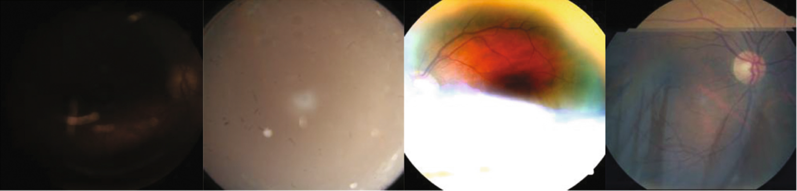
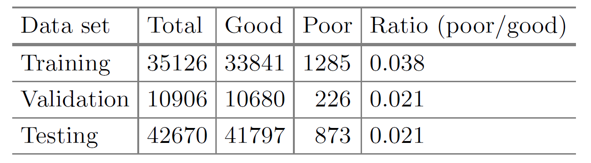

# Code
To be released

# Kaggle DR dataset
EyePACS: Diabetic retinopathy detection. https://www.kaggle.com/c/diabetic-retinopathy-detection/data

# Kaggle DR Image Quality Dataset
## Four instances of poor quality images in Kaggle DR dataset

The quality of these images are too poor to identify the lesion.

## Unbalanced ratio
In our Kaggle DR image quality dataset, the number of good and poor quality images are shown as follows. The ratio is extremely unbalanced.

## Quality Label
The csv files are in *quality_csv_label*

  _quality_label_train.csv_
  
  _quality_label_validate.csv_
  
  _quality_label_test.csv_

  **0 denotes poor quality**
  
  **1 denotes good quality**

# Citation
If you find this useful, please cite our work as follows:
***
